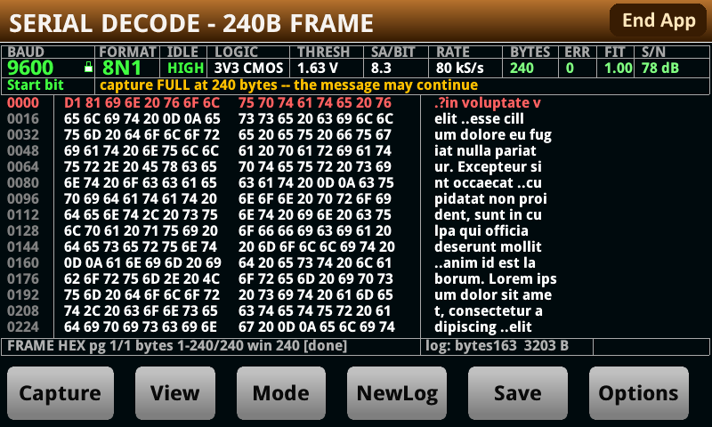

# Serial Decode — Keithley DMM6500, DAQ6510, DMM7510, SMU2461

A UART decoder that runs on a Keithley bench instrument. It digitizes the line with the
instrument's own digitizer, automatically recovers the baud rate, frame format and idle polarity from the signal,
and shows the bytes on the front panel as text or hex. No host, no logic analyser, no setting baud rates, stop bits, data bits, parity, etc - just one probe, and one button press. The signal must swing by at least 0.5V, lie between -10V and +10V, have no more than 15% noise, and under 10% clock jitter. Any baud rate will work - even non standard ones. Any DC offset is fine so long as these conditions are met. 

Ian Ameline · **version 1.37** · MIT licence (see [LICENSE](LICENSE))

*The instrument's own front panel, no host attached: 239 bytes of a 240-byte capture at 9600 baud 8N1,
no framing errors, S/N 74 dB. The padlock on the BAUD cell means the rate is pinned here rather than
re-detected each capture.*

| | |
|---|---|
| [docs/MANUAL.md](docs/MANUAL.md) | using it: hooking up, the screen, the buttons, what it copes with, where it fails |
| [docs/REFERENCE.md](docs/REFERENCE.md) | every measured number, and the firmware limits behind them |
| [docs/BENCH.md](docs/BENCH.md) | the harness: the seeded sweep, the release gate stage by stage, reproducing a failure |

Ships as `Serial_Decode.tspa`, installed from a USB key through the instrument's own **Manage Apps**
screen. Written in TSP — Lua **5.0.2** embedded in the firmware, so the sources avoid `#`, `%`,
`string.gmatch` and bitwise operators throughout.

## Installing it

The app ships as a single file, **`Serial_Decode.tspa`**. It installs from a USB key through the
instrument's own **Manage Apps** screen — no host software, no driver, nothing to compile. The archive
is plain ASCII: a `loadscript Serial_Decode` wrapper around the six modules and an icon, so it can be
read and diffed like any other source file.

**1. Copy the archive to a USB key.** Put [`Serial_Decode.tspa`](Serial_Decode.tspa) in the **root** of
a FAT-formatted key. Leave the name as it is.

**2. Put the key in the front-panel USB port.**

**3. Install it from the front panel**, through **MENU ▸ Manage Apps**, which copies the app into the
instrument's internal memory. The exact wording of that screen varies between models and firmware
revisions; it is the one that lists the apps on the key.

**4. Run it** from the instrument's **Apps** menu. The app takes its first capture as it starts, so a
line that is already carrying traffic decodes immediately — and if nothing is connected yet it says
`line is idle (no transitions)` and waits.

**5. Leave the key in, or take it out.** With a key in the slot the app appends decoded bytes to a log
and the `Save` button writes a report; with no key it captures and decodes exactly the same in every
mode, says `log: no USB key`, and reports a recording as `NOT recorded` rather than naming a file. The
key may be removed and replaced while the app runs.

### Hooking up the probe

**`INPUT HI` and `INPUT LO` on the front terminals.** `LO` to the ground of the circuit you are
probing, `HI` to the line you want to read — everything is measured at HI relative to LO, so without a
shared ground the readings mean nothing.

* **Keep the line between −10 V and +10 V.** The app fixes the meter on its 10 V range. 3.3 V CMOS,
  5 V TTL and a 6 V LIN line tapped to ground need nothing in front of them. For 12 V, use a 2:1
  divider — and on an open-drain bus pick resistors big enough not to load it down.
* **A DC offset does not matter.** The app measures the two levels on your line and puts its threshold
  between them, and it works out the idle polarity from the signal itself.
* **Do not put a differential bus across HI and LO.** RS-485, CAN and LIN want a transceiver first, or
  tap one side of the pair against ground.
* **A signal whose band straddles ground is decoded inverted, deliberately** — see
  [docs/BETA.md](docs/BETA.md), which lists the behaviours that look like defects and are not.

Then: press **Capture** while the device is talking, and **View** to switch between hex and text. The
[manual](docs/MANUAL.md) covers the rest of the panel, the bit rates it reaches, and what a marginal
signal looks like.

### Building the archive yourself

Only needed if you have changed anything in [`tsp/`](tsp/):

    python3 tools/package_tspa.py         # concatenates tsp/*.tsp into Serial_Decode.tspa

## Everything else

| | |
|---|---|
| [docs/PROJECT.md](docs/PROJECT.md) | what to know before trusting it, the measured endurance figures, which instruments it runs on, how to report a bug, and the release gates |
| [tools/README.md](tools/README.md) | the harness: offline suites, the bench sweep, the release gate |
