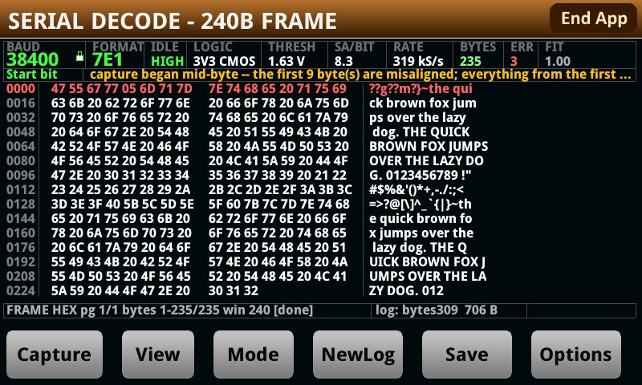
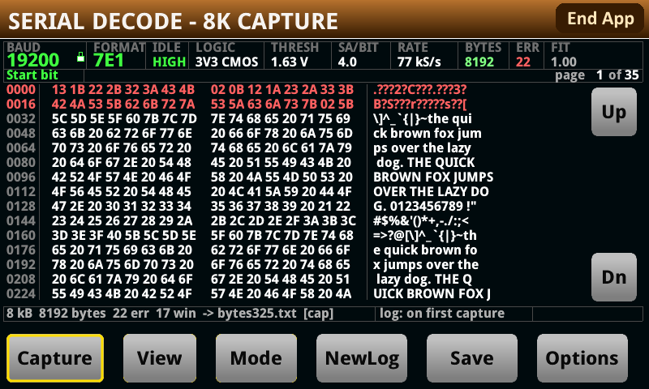
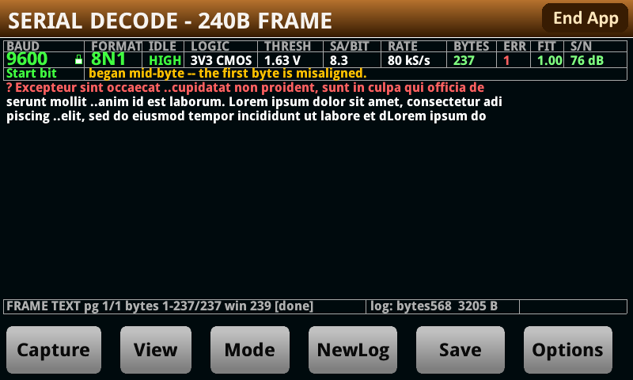
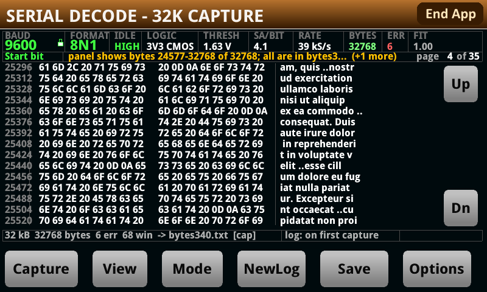
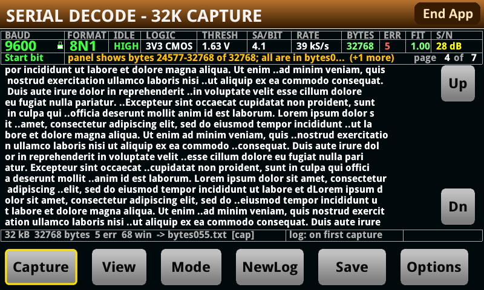
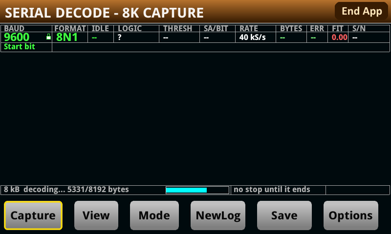
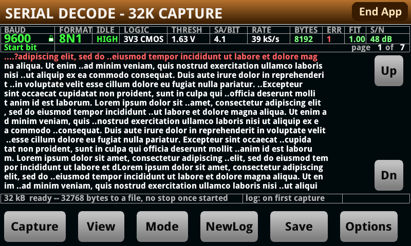
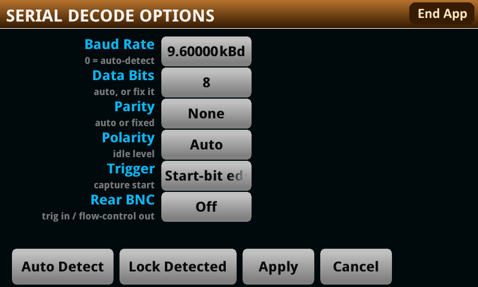

# Serial Protocol Decode — user manual

**Ian Ameline** · version 1.03 — **beta** · MIT licence

This app turns a Keithley DMM6500 into a serial decoder. Clip onto a UART line, press **Capture**,
and read the bytes on the front panel. You do not have to tell it the baud rate, the frame format or
which way up the signal is — it works all of that out from the signal itself.

Three things make it worth reaching for over a scope's decode: the **window is large** (a screenful
is ~240 bytes, and a recording holds 32 768), every capture is **appended to the USB key
automatically** while a key is in the slot, so you have a log without asking for one, and the **serial parameters are detected rather than
configured**. For most debugging that is the whole job — connect, press, read.

> **This is a beta.** Every number in this manual was measured on a real DMM6500 against a real
> signal generator unless the text says otherwise — and where something is calculated rather than
> measured, or untested, it says so in that spot. What that cannot cover is the variety of real devices, so if the app tells you
> something you can prove is wrong, that is the bug worth reporting. It is built so that **refusing
> with a reason is acceptable and confident nonsense is not**, and anything it is unsure about it
> says on the note row at the bottom of the screen.

---

## Hooking it up — read this part

**The line must stay between −10 V and +10 V.** The app fixes the meter on its 10 V range. 3.3 V
CMOS and 5 V TTL are both fine as they are. For a 12 V line, put a 2:1 resistor divider in front of
it — and if it is an open-drain bus, pick resistors big enough not to load it down.

**Connect INPUT LO to the ground of the circuit you are probing.** Everything is measured at INPUT HI
relative to INPUT LO, so without a shared ground the readings mean nothing.

**Do not put a differential bus straight across HI and LO.** RS-485, CAN and LIN need to go through a
transceiver first, or you need to tap one side of the pair against ground.

**A DC offset does not matter.** The app measures the two voltage levels on your line and puts its
decision threshold between them, so it does not care where they sit — only that both fit inside
±10 V. A 1.6 V swing sitting up at 6 V decodes fine. **1.6 V is the smallest swing tested.** A 60 mV
swing is refused outright.

---

## Quick start

1. Connect the line to **INPUT HI** and its ground to **INPUT LO**.
2. Press **Capture** while the device is talking.
3. Read the bytes. Press **View** to switch between hex and plain text.

That is the whole normal workflow. The first capture also locks the baud rate when it is confident,
so later captures are faster.

Two more things worth knowing before you need them: **Mode** turns Capture into a recording of up to
32 768 bytes straight to the USB key, still one press — and once a long job starts, **nothing stops it
early**, so decide the size before you press — see **The TRIGGER key** below.

---

## The screen

Along the top are the things the app worked out about your line:

| Field | Meaning |
|---|---|
| **BAUD** | The rate it found. A padlock means it is locked and will not be re-detected. |
| **FORMAT** | Data bits, parity, stop bits — `8N1`, `7E1` and so on. |
| **IDLE** | What the line rests at: `HIGH` for CMOS/TTL, `LOW` for an RS-232-style line. |
| **LOGIC** | The family it looks like, e.g. `3V3 CMOS`, `5V TTL`. |
| **THRESH** | The voltage it is using to tell 0 from 1. |
| **SA/BIT** | Samples per bit. More is better; 8 is comfortable, 4 still works. |
| **RATE** | How fast the meter sampled. |
| **BYTES / ERR** | How many bytes came out, and how many were broken. |
| **FIT** | How well one bit-length explains what it measured, from 0 to 1. Below about 0.9 means the timing was messy. |

A dash means "not measured yet".

**Broken bytes are shown, not hidden.** `ERR` turns red when there are any, and every row containing
one is drawn red across its whole width — offset, hex and ASCII together — so damage is found by
looking rather than by counting. Flagged bytes read as `?` in the ASCII gutter:

That is a real 8 kB recording that began part way through a byte: 22 of 8192 bytes failed, all of them
in the first two rows, and everything from the first gap onward decoded cleanly. The status row counts
them (`8192 bytes  22 err`) and the file on the USB key holds all 8192 either way — a byte that failed
its parity or stop bit is still written, marked, rather than dropped.

Underneath: the **trigger cell**, the bytes, then two rows of text. The **status row** tells you where
you are (`FRAME HEX pg 1/1 bytes 1-155/155 win 240 [done]`) and names the log file.

**Which mode you are in is in the title bar** — `SERIAL DECODE - 240B FRAME`, `- 8K CAPTURE` or
`- 32K CAPTURE`, in the largest type on the screen.

**The cell at the left of the note row is what a capture WAITS for**, colour-coded so a glance is
enough: green `Start bit` (the normal case — it waits for the line's own start bit), yellow `Free run`
(it does not wait for anything), cyan `Trigger key` (it waits for the physical key).

**The cell at the bottom right is the rear BNC**, and it is **empty when the rear BNC is off** — which
is the default. When it is not, it names the direction: green `EXT TRIG IN`, amber `EXT TRIG OUT`,
cyan `EXT TRIG I/O`. A trailing `?` means the input is switched on but *not in force*, which happens
under `Free run` — free run means do not wait, so there is nothing for the input to gate.

During a recording the status row carries a live counter — `recording... 40 % of the buffer`, then
`decoding... 4096/8192 bytes` — with a **cyan progress bar** beside it, and the cell to its right reads
`Capture or Mode = Stop`.

**View** switches the same bytes to plain text, which is what you want for anything human-readable:

**The note row is the important one.** Warnings appear there — an ambiguous baud rate, a line that
disagrees with the rate you locked, a recording that stopped early. If more than one applies it ends
with `(+2 more)`, and pressing **Save** writes all of them to a file.

Here it is doing that — a capture that started part way through a byte, which the app detected and
said so rather than showing nine wrong bytes without comment:

**An empty note row is not a promise that everything is perfect.** It means the app did not detect
anything wrong. A noise spike landing inside a data bit changes that byte with nothing to give it
away.

---

## The buttons

| Button | Does |
|---|---|
| **Capture** | Take a capture and decode it. In a recording mode, does the whole recording. |
| **View** | Switch the display: hex + ASCII → plain text → back. |
| **Mode** | Choose what Capture does: a screenful, an 8 kB recording, or a 32 kB one. |
| **NewLog** | Start a new numbered log file on the USB key. |
| **Save** | Write a full report of what is on screen to the USB key. |
| **Options** | The settings screen. |
| **Up** / **Dn** | Right-hand edge. Only appear when there is more than one page. Once you press either, **page N of M** appears at the right of the note row. |
| **Lock Rate** | Right-hand edge. Only appears when the rate is not locked. |

Every button responds immediately except the ones that take a capture. **Capture takes about 1.7
seconds when the rate is locked, and 4 to 9 seconds when it is not** — because to find an unknown
rate it has to capture two or three times. Slower lines take longer, not less. The exact time varies
from press to press because it depends on where the traffic happens to be when you press.

**A press during a capture is not lost — it is queued** and acted on when the capture finishes. So
if the panel seems to ignore you, wait rather than pressing again.

### Paging through a long capture

A 32 kB recording is far more than one screen, so **Up** and **Dn** appear down the right-hand edge and
**page N of M** appears at the right of the note row — the two numbers in white, the words dimmed, so
the count reads at a glance. The note beside it says which bytes are on screen and that the whole run
is in the file, which is the thing you cannot otherwise tell from a screenful taken out of the middle:

    panel shows bytes 24577-32768 of 32768; all are in bytes323.txt

The offset column agrees with it — the rows above start at 25056, not at zero — and the status row
carries the run's own summary: 32768 bytes, 1 error, 68 windows, and the file it went to.

**The page count follows the view.** Press **View** on that same capture and it becomes 7 pages instead
of 35, because a text row holds 80 characters and a hex row holds 16 bytes — 1200 bytes a page against
240:

Nothing about the capture changed; only how much of it fits on a screen. The byte range in the note row
is the same, and so is the summary.

## The TRIGGER key — the one hardware button that matters

The **TRIGGER** key is the physical key on the front panel, to the **right** of the screen — the lowest
of that column of buttons. It is not part of the app's own row of buttons. It was intended to do two
things nothing on the glass can do; **one of them works** — timing a capture — and the other, stopping
a long job, does not. Both are described below, because knowing which is which is the difference
between waiting confidently and pressing a key that does nothing.

### 1. It does not stop a long job, and nothing else does either

**A recording runs to its own end.** Once you press **Capture** in `8 kB` or `32 kB`, nothing on the
instrument will cut it short — not a button on the glass, and not the TRIGGER key. Decide before you
press. The status row says so before you commit:

    32 kB  ready -- 32768 bytes to a file, no stop once started

**There is deliberately no time estimate.** The one that used to be there was the time your *device*
takes to send that many bytes, and the meter's decode costs several times more — 8 kB is a couple of
seconds on the wire and around half a minute to decode. A single number would have been reassuring and
wrong, so what you get is the exact byte ceiling and, once it starts, a progress bar.

**The app's own side of this is sound,** which is why it is worth fixing rather than accepting: when
the identical cancel is delivered by a firmware timer instead of a finger, the run stops inside a
second, keeps every byte decoded up to that point, and files them. What is missing is a route from a
key press to that mechanism.

**What does bound a run,** so it can never hold the panel indefinitely:

- the byte ceiling for the mode — 8192 or 32768;
- a quiet line: one second with no activity ends it;
- under flow control, 32 windows or 20 minutes of wall clock, whichever comes first. The 20 minutes is
  what matters on slow lines, where a full 32 kB window would take 18 minutes at 300 baud.

**A tap on Capture during a run is not a stop.** It is queued by the instrument and delivered when the
run finishes. The app recognises presses made during the run it has just finished and discards them,
saying so on the note row, rather than starting another recording you did not ask for.

### 2. It can time a capture

Set `Options ▸ Trigger = Trigger key`, press **Capture**, and the capture waits for you:
it fires when you press the physical key, so you decide the moment the line is sampled. Verified on
this hardware — armed on a deliberately idle line, the capture fired on the key press rather than
timing out.

If the trigger you chose never arrives, the capture goes ahead free-running after a few seconds rather
than failing, and the note row says which one was missing.

These two jobs never collide: the key times a capture only when you have asked for that in Options,
and stops a run only while one is going.

---

## How much you can capture at once

Four answers, and almost everyone only ever needs the first. **All of them are one press.**

| You need | Use | Get |
|---|---|---|
| a look at what a device is saying | **FRAME** — just press Capture | ~**240 bytes**, on screen |
| a longer burst, quickly | **Mode** → `8 kB`, then Capture | up to **8 192 bytes**, to a file |
| the longest single recording | **Mode** → `32 kB`, then Capture | up to **32 768 bytes**, to a file |
| more than that, losslessly | flow control, and a device that obeys it | as much as you like, ~20 minutes per press |

**FRAME is the normal case and covers almost all debugging.** One press gives you a screenful,
already decoded, with the baud rate and frame format worked out for you and a copy appended to the
USB key automatically. You do not have to set anything up or lock anything down.

### Recording to a file

Press **Mode** until the cell reads `8 kB` or `32 kB`. **You must lock the baud rate first** — press
**Lock Rate**, or type the rate into **Options**. Then **press Capture once**, and that press does the
whole job: it records, decodes every byte, writes them to the USB key, and comes back with the tail on
screen. There is nothing to press in the middle.

While it works, the counter on the status row moves — first `recording... N % of the buffer`, then
`decoding... N/8192 bytes` — with a cyan progress bar beside it, and the cell to its right says
whether anything can stop it. The screenshot above is a real 8 kB run caught at 7772 of 8192 bytes
decoded; the dump area is blank because nothing has been shown yet, and the note row is empty because
there is nothing wrong. **There is no way to finish it early** — see the section on the TRIGGER key
above for what bounds it instead.

**When it finishes, the note row goes quiet.** The status row's summary — bytes, errors, window count
and filename — is the completion message; the yellow note row is reserved for what went wrong, so an
empty one after a recording means there was nothing to say.

It stops by itself when the window is full or when the line has been quiet for a second. There is also
a 20-minute backstop, so nothing can wait for ever — it only matters on very slow lines, where a full
32 kB window takes 18 minutes at 300 baud.

**Nothing is dropped inside a recording.** What you get is a continuous, in-order run of the line —
verified with a 1024-byte non-repeating test pattern, where the decoded bytes were one unbroken slice
of it.

> **If a `Processing reading backlog...` dialog appears, ignore it. Do not press Abort.**
>
> It is the instrument's own message, not the app's: the digitizer is producing readings faster than
> the meter is moving them out of the buffer. It **clears by itself** and the recording carries on
> normally.
>
> Seen on the bench from 38.4 kBd upwards — at 182 kS/s, at 635 kS/s recording a 76.8 kBd line, and
> within a second of pressing Capture at 1 MS/s on a 115.2 kBd line. Every one of those recordings
> completed and decoded correctly, including a full 32 kB one.
>
> Pressing **Abort** would stop the acquisition the dialog is describing, which is the one thing that
> actually loses the capture. There is nothing to do but let it run.

### Which window size to pick

The window is the unit of work: one press records a window, decodes it, and files it. So the size is a
straight trade, and neither choice affects what gets decoded — both are lossless.

| | `8 kB` | `32 kB` |
|---|---|---|
| Bytes per press | 8 192 | 32 768 |
| Recording, at 9600 baud | ~8.5 s | ~34 s |
| Decoding afterwards | ~30 s | ~2 minutes |
| Best for | seeing something soon, and stopping soon | the most data for the fewest presses |

**Decoding is the slow part**, and it is slower than the line: the meter decodes roughly 300 bytes a
second whatever the baud rate. That is why `8 kB` feels much more responsive even though both are one
press.

**The app starts in FRAME**, and one press of **Mode** reaches `8 kB`, a second `32 kB`. Stop at
`8 kB` when you would rather see bytes soon than see all of them, or while you are still working out
whether you are probing the right pin; go on to `32 kB` when you want the most data for the fewest
presses.

Above: an 8 kB recording has finished and **Mode** has been pressed once, so the title bar reads
`32K CAPTURE` while the previous run's retained tail is still on screen. Note what the panel is saying
— `Up` and `Dn` have appeared because the tail is more than one page, the status row states the next
run's ceiling and that nothing will stop it, and **the note row is empty**, because a recording that
worked has nothing to warn about.

**The mode you choose stays chosen.** The title bar says which one you are in — `SERIAL DECODE - 240B
FRAME`, `- 8K CAPTURE` or `- 32K CAPTURE` — and a recording that finishes leaves it alone, so pressing
Capture again records another window. Only **Mode** changes it. Two things move it for you, and both
say so on the note line: **Options ▸ Auto Detect**, because auto-detection cannot run in a recording
mode at all, and clearing the baud rate, because a recording needs it locked.

### More than one window: flow control

A window is not a total. If your device is built to wait, you can capture as much as you like without
losing a byte, **and without pressing anything per window** — up to 32 windows or 20 minutes per press,
whichever comes first. To carry on past that, press **Capture** again; it resumes where it stopped, in a new file.

Set `Options ▸ Rear BNC = FC Out`. The rear EXT TRIG OUT then emits **one ~5 V, ~10 µs pulse each
time a capture is armed** (measured on a scope: 4.92 V, 9.4–9.8 µs — the width is the meter's own
default and this firmware does not let the app change it) — a credit meaning *"send now, and send no more than one window's worth"*.
Then one press of **Capture** runs the whole conversation: credit, record, decode, file, credit
again — round and round, with the window number on the status row, until the device stops sending.
While the app is decoding, nothing is armed, no credit is issued, and a device that waits stays quiet,
so the gap where bytes could be lost is closed by design. Everything lands in one file, in order.

It ends when your device goes quiet after a credit, or when it reaches one
of two backstops: **32 windows** or **20 minutes**. There is no key that ends it early. Those exist so a device that never stops talking
cannot leave the panel busy for ever, and the 20 minutes is usually the one you meet — decoding a
window takes longer than recording it, so 20 minutes is about eight windows at 9600 baud rather than
32.

If it stops for either reason it says which, and it tells you how to carry on: **press Capture
again.** A finished recording leaves you in the mode you chose — the title bar still reads
`SERIAL DECODE - 32K CAPTURE` — so it is one press, and the bytes that follow go into a **new**
numbered file rather than the one it was just writing.

**No bytes are lost in the gap.** Your device only transmits when it is credited, and no credit goes
out until the next recording arms, so it is still waiting exactly where the run stopped. What you get
is one conversation split across two files, in order, with nothing missing between them.

Three things your device has to get right:

- **Catch a 10 µs pulse.** That is short: use an interrupt, an edge-triggered input or a hardware
  latch. A firmware polling a GPIO in a loop can miss it, and at 250000 baud 10 µs is only 2.5 bit
  times. It is a pulse per window, not a level you can poll once.
- **Send no more than one window per pulse** — 8 192 or 32 768 bytes depending on the mode. The pulse
  carries no size information, so the limit has to be built into your firmware.
- **Go quiet when it has nothing to send.** That silence is what tells the app the transmission is
  over.

**Honest limitation:** the pulse itself is verified — 4.92 V, ~10 µs, one per arm, measured on a
scope — and the loop that issues them is tested. The full round trip, with a device that actually waits
for the pulse, has **not** been tested here, because the signal generator on this bench cannot be
gated by the meter's trigger output. The mechanism is sound by construction; you would be the first to
close the loop.

### How long a recording gets you

There are two different times here and it is worth keeping them apart:

- **Signal** — how much of the line ends up in the file.
- **Waiting** — how long you stand there before the buffer is full.

Below about 19200 baud they are the same. Above it they are not, because the meter writes about
**100 000 readings a second** into its memory however fast the digitizer is told to sample. The samples
are properly spaced and the record is complete; gathering them just takes longer than the stretch of
line they represent, so you stand there longer than the signal you get.

That ceiling is a separate thing from the sample rate, and the two are easy to confuse. The **sample
rate** decides how many samples land in each bit — a frame capture gets very nearly the rate it asks
for, a recording's burst gets somewhat less, and that difference is what limits recording to 153600
baud (above). The **100 000 readings a second** is not about fidelity at all: it is how fast readings
reach memory, and it decides only how long you wait.

| Locked rate | Signal you get | Waiting for the full 32 kB |
|---|---|---|
| 300 Bd | 1092 s | the same |
| 1200 Bd | 273 s | the same |
| 2400 Bd | 136 s | the same |
| 4800 Bd | 68 s | the same |
| 9600 Bd | 34 s | the same |
| 19200 Bd | 17 s | the same |
| 38400 Bd | 8.5 s | about 17 s |
| 57600 Bd | 5.7 s | about 17 s |
| 115200 Bd | 2.8 s | about 18 s |
| 153600 Bd | 2.1 s | about 21 s |

Every row is the same 32 768 bytes — what changes is how long that takes to go past. The `8 kB`
window is a quarter of each figure. Then add the decoding, which does not depend on the baud rate:
about two minutes for 32 kB, half a minute for 8 kB.

**You do have to fill it.** There is no way to stop a recording early — see the TRIGGER key section
above — so choose the window with the whole wait in mind.

**153600 baud is the fastest rate that can record. Above that, FRAME only.**

The reason is that a recording and a frame capture do not get the same sample rate out of the same
request. A frame capture gets very nearly the 1 MS/s it asks for; a recording's burst acquisition loses
about half a microsecond per sample, so the same request delivers about 662 kS/s. The floor is four
samples per bit, and the crossover works out at **165563 baud** — so of the standard rates, 153600 is
the last one that clears it, at 4.3 samples/bit.

Above it the app **refuses before you press**, on the note row, naming the figure a recording would
actually get:

    192000 Bd: a recording gets 3.4 samples/bit, under the 4 floor -- use FRAME

That figure is deliberately the recording's, not the header's. The `SA/BIT` cell will read about 5.2 at
192000 baud, which is true of the frame capture it was measured from — the two are different
acquisitions, and the note says which one it means.

**FRAME keeps working to the full 250000 baud**, and usefully so: at 192000 baud a frame capture holds
384 bytes.

---

## Reading the bytes

The hex view shows two groups of eight bytes and then the same bytes as text. The offset down the
left is dimmed because it is there to navigate by, not to read. A byte that could not be recovered
shows as `--`.

**`ERR 0` does not mean the bytes are definitely right.** It counts broken stop bits and parity
failures. Noise landing inside a data bit flips it with nothing to detect — which is why the note row
matters more than the error count.

If you see **`capture began mid-byte — the first N bytes are misaligned`**: on a line that never goes
quiet, the capture starts wherever it starts, and if that is halfway through a byte the first few
bytes are chopped up wrongly. They are shown rather than hidden, but **do not trust their values**.
Everything after the first gap in the traffic is fine. On traffic with normal gaps between messages it
costs **5 to 12 bytes**; on a line that never pauses it can be far more — **up to 165 bytes measured**
on back-to-back text at 250000 baud, because there is no gap to resynchronise on. A device that pauses
between messages never shows it at all.

---

## Locking the baud rate, and the amber padlock

The app locks the rate for you after a good capture, which is why later captures are quicker. It only
does this when it is confident: the rate landed on a standard one, enough clean frames came through,
`FIT` was 0.9 or better, and the voltage levels were steady.

When it is not confident it leaves the padlock **amber** and offers you the **Lock Rate** button. The
bytes are still shown — they just are not trusted enough to carry forward. Press **Lock Rate** to pin
it anyway, or capture again.

**Auto-lock never locks polarity.** It is worked out fresh on every capture, on purpose: guessing it
wrong once and then sticking to it is how you get a confident, completely wrong decode. (**Lock
Detected** on the Options screen *does* copy the detected polarity into the fields along with
everything else — but there you can see what it picked before you commit it.)

### If the line changes rate, the app gives the lock up

A locked rate is a promise about the wire, and when the wire stops keeping it the lock is worse than
useless — it turns every frame into an error and nothing gets better by pressing Capture again. So when
**all three** of these hold, the app **drops the lock by itself** and re-detects from the same samples:

- a rate is locked;
- the bit time it measures on the wire disagrees with that rate;
- more than a quarter of the frames in the middle of the capture failed.

It says so on the note row, naming the rate it discarded — `19200 baud fit nothing -- unlocked, and
this capture reads 38400` — and from there auto-lock pins the new rate on the usual terms. That is the
same result as typing `0` into Options by hand, which is what you had to do before.

**The middle condition is what protects a rate you typed deliberately.** If the rate fits the wire and
the *format* is wrong, every frame fails too — but the measurement agrees with your number, so your
number is kept.

---

## Options

| Setting | What it does |
|---|---|
| **Baud Rate** | `0` means auto-detect. Type a number to lock that rate; it is rounded to a whole baud. |
| **Data Bits** | Leave on `Auto (7/8)`. Only use `Auto (any)` if you know the device sends 9-bit words — it can make a damaged capture look tidier while being wrong. |
| **Parity** | `Auto`, or pin `None` / `Even` / `Odd`. |
| **Polarity** | `Auto`, `Idle high` (normal CMOS/TTL) or `Idle low` (inverted). Auto is reliable unless the line is almost never idle. |

Each setting is independent — pinning one leaves the rest on auto.

**Apply** commits your changes and takes a capture. **Cancel** puts everything back to how it was
when you opened the screen. **Auto Detect** forgets everything locked, takes a fresh capture, and
locks whatever that finds — it is the quick way back when you have locked onto the wrong thing.
**Lock Detected** copies the last capture's settings into the fields so you can look at them before
committing.

There is no stop-bit setting. A second stop bit looks exactly like a bit of idle line, which the
decoder already copes with, so a 2-stop device decodes correctly and is reported as 1 stop.

### Advanced

Two settings you can ignore unless you need them:

- **Trigger** — what starts the acquisition. `Start bit` (the default) waits for the line to move.
  `Free run` grabs immediately. `Trigger key` waits for the front-panel TRIGGER key, as described
  under **The TRIGGER key** above. **If the thing you asked for never happens, the capture goes ahead
  anyway** after a few seconds and the note row names
  the one that did not arrive — `edge trigger unavailable; captured free-running`, or `front` for the
  TRIGGER key. Those bytes are real but they are not lined up with the event you wanted.
- **Rear BNC** — lets an external trigger in on the rear connector, and `FC Out` sends the
  flow-control credit pulse out of EXT TRIG OUT. `FC Out` is what turns a recording into an unlimited
  one; see **More than one window: flow control** above.

This setting affects FRAME captures. **A recording ignores it** and starts as soon as you press
Capture — for a recording, the thing that decides when the device talks is the flow-control credit,
not a trigger.

---

## Files on the USB key

Two different files, and they are not the same thing:

| File | Written | Holds |
|---|---|---|
| `/usb1/bytesNNN.txt` | automatically, on every capture | the running log — every capture's bytes as text and hex. **NewLog** starts a new number. |
| `/usb1/serial_NNN.txt` | only when you press **Save** | a full report of what is on screen: settings, all the notes, the whole dump. |

A recording decodes into the log file, so the file holds the whole run while the panel shows only the
tail of it. The note row says so when they differ.

**Recording needs a USB key** — the file is the point of it. Normal FRAME captures work without one;
they just cannot log or Save.

---

## When something looks wrong

| What you see | What it means |
|---|---|
| `line is idle (no transitions)` | Nothing is crossing the threshold. Check your connection, and check the device is actually talking while you capture. |
| `no clear logic levels` | Too much noise, or the swing is too small. 1.6 V works; 60 mV is refused outright. |
| Wrong rate reported | The traffic may be genuinely ambiguous (below). Lock the rate if you know it. |
| Bytes wrong but `ERR 0`, with the rate locked | The device is not running at the rate you locked. The note row warns when the line disagrees by more than 4 %. |
| A baud rate that is not a round number | It is reporting what it measured, because the measurement was not within 2 % of a standard rate. |

**Some traffic is genuinely ambiguous, and no decoder can fix it.** Eight `0x00` bytes at 9600 baud
7N1 make exactly the same waveform as four `0x08` bytes at 4800 baud 8N1. The app tells you a rival
rate fits rather than pretending to know. Irregular gaps between bytes remove the ambiguity
completely.

---

## What it can cope with

Measured at 8 samples per bit. Past every one of these limits the app **reports** the problem rather
than quietly getting it wrong, except where noted.

| Condition | Works up to |
|---|---|
| Wrong clock, rate **locked** | **±4 %**. Beyond that a fast device corrupts bytes with nothing to show it |
| Wrong clock, **auto-detect** | ±12 % and past — it measures instead of assuming |
| Jitter | **±15 %** of a bit; past ±20 % it can fail quietly |
| Noise | about **40 %** of the logic swing — roughly 1.3 V on a 3.3 V line |
| Slow edges, long cables, weak pull-ups | filtering up to **0.7 bit times** |
| Logic swing | **1.6 V** up to 5 V TTL |
| DC offset | anything that keeps the line inside ±10 V |

**Rates from 300 to 250000 baud** decode byte-exact on the bench, and so do odd ones — 900, 1500,
3600, 7200 and arbitrary values like 1379, 8123 and 104857. Two exceptions are known and both are
**flagged rather than silent**: long gapless payloads at 2400 baud produce one to three damaged frames
in a few hundred, and one 250000-baud run matched 497 of 499 bytes with the odd byte marked. A rate within 2 % of a standard one is reported as
the standard one, because real devices use standard rates.

**Tolerance follows samples per bit, not baud rate.** A slow line is not automatically the safe one —
read `SA/BIT`.

**If you are writing the firmware at the other end**, two things help: keep your edges within ±15 %
of a bit time (that is ±15.6 µs at 9600 baud but only ±1.3 µs at 115200, so if an interrupt can
delay your transmit loop, send slower), and avoid padding with `0xFF`, which gives the rate detector
only one narrow pulse per frame to measure. `0x00` padding is fine.

---

Measured figures, the full tolerance envelope, press-by-press timings and the reasoning behind the
design are in **[REFERENCE.md](REFERENCE.md)**.
