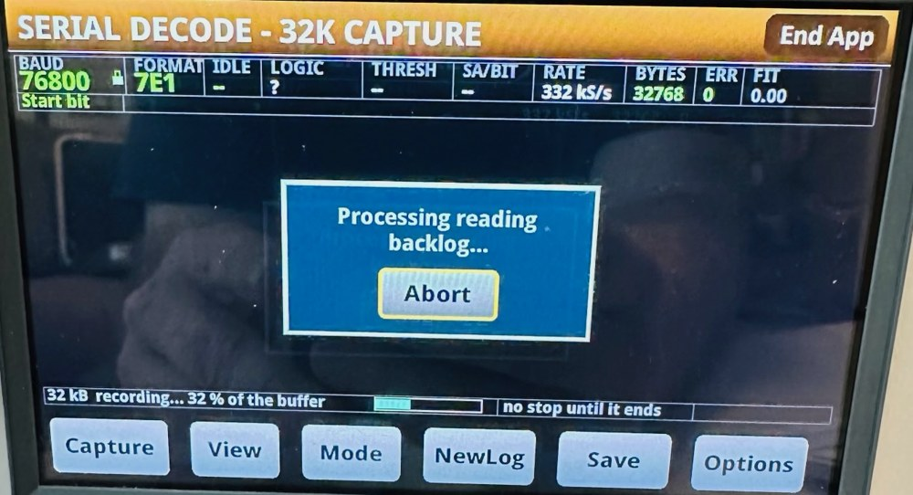

# Serial Decode — user manual

**Ian Ameline** · version 1.11 · MIT licence

This app turns a Keithley bench instrument into a serial decoder. Clip onto a UART line, press
**Capture**, and read the bytes on the front panel. You do not have to tell it the baud rate, the frame
format or which way up the signal is — it works all of that out from the signal itself.

It was written on a **DMM6500** and that is **the only instrument it has been tested on**. It should
run as it is on the rest of the Keithley TSP range that has a digitizer and the touchscreen app API —
the DAQ6510 and DMM7510 in particular, and it will install on an SMU2461 and try — but nobody has run it
there yet. `Which instruments` in the
README says what is measured and what is inference.

Three things make it worth reaching for over a scope's decode: the **window is large** (a screenful
is ~240 bytes, and a recording holds 32 768), every capture is **appended to the USB key
automatically** while a key is in the slot, so you have a log without asking for one, and the **serial parameters are detected rather than
configured**. For most debugging that is the whole job — connect, press, read.

> **Every number in this manual was measured on a real DMM6500** against a real
> signal generator unless the text says otherwise — and where something is calculated rather than
> measured, or untested, it says so in that spot. What that cannot cover is the variety of real devices, so if the app tells you
> something you can prove is wrong, that is the bug worth reporting. It is built so that **refusing
> with a reason is acceptable and confident nonsense is not**, and anything it is unsure about it
> says on the note row at the bottom of the screen.

---

## Hooking it up — read this part

**The line must stay between −10 V and +10 V.** The app fixes the meter on its 10 V range. 3.3 V
CMOS, 5 V TTL and a 6 V LIN line tapped to ground are all fine as they are. For a 12 V line, put a
2:1 resistor divider in front of it — and if it is an open-drain bus, pick resistors big enough not
to load it down.

**Connect INPUT LO to the ground of the circuit you are probing.** Everything is measured at INPUT HI
relative to INPUT LO, so without a shared ground the readings mean nothing.

**Do not put a differential bus straight across HI and LO.** RS-485, CAN and LIN need to go through a
transceiver first, or you need to tap one side of the pair against ground.

**A DC offset does not matter.** The app measures the two voltage levels on your line and puts its
decision threshold between them, so it does not care where they sit — only that both fit inside
±10 V. A 1.6 V swing sitting up at 6 V decodes fine. **The tested range is a 0.33 V swing to an 8 V
swing**, and signals spanning 9.3 V peak-to-peak decode when the extra span is spikes on a smaller
logic swing. A 60 mV swing is refused outright.

**A small swing needs a quiet line, not a special setting.** The noise the app tolerates is a
fraction of your swing, around 40 %, so 50 mV of noise is nothing on a 3.3 V line and a tenth of the
budget on a 0.5 V one.

---

## Quick start

1. Connect the line to **INPUT HI** and its ground to **INPUT LO**.
2. Press **Capture** while the device is talking.
3. Read the bytes. Press **View** to switch between hex and plain text.

That is the whole normal workflow. The first capture also locks the baud rate when it is confident,
so later captures are faster.

Two more things worth knowing before you need them: **Mode** turns Capture into a recording of up to
32 768 bytes straight to the USB key, still one press — and once a long job starts, **nothing stops it
early**, so decide the size before you press — see **The TRIGGER key** below.

---

## The screen

Along the top are the things the app worked out about your line:

| Field | Meaning |
|---|---|
| **BAUD** | The rate it found. A padlock means it is locked and will not be re-detected. |
| **FORMAT** | Data bits, parity, stop bits — `8N1`, `7E1` and so on. |
| **IDLE** | What the line rests at: `HIGH` for CMOS/TTL, `LOW` for an RS-232-style line. |
| **LOGIC** | The family it looks like, e.g. `3V3 CMOS`, `5V TTL`. |
| **THRESH** | The voltage it is using to tell 0 from 1. |
| **SA/BIT** | Samples per bit. More is better; 8 is comfortable, 4 still works. |
| **RATE** | How fast the meter sampled. |
| **BYTES / ERR** | How many bytes came out, and how many of them you cannot trust. |
| **FIT** | How well one bit-length explains what it measured, from 0 to 1. Below about 0.9 means the timing was messy. |
| **S/N** | How far your two logic levels stand above the noise sitting on them, in dB. Bigger is quieter. |

A dash means "not measured yet".

**`FIT` and `S/N` are coloured, and the colour is the quick read.** Green means there is margin, amber
means there is some but not much, red means you are close to the edge — so the top line can be checked
at a glance instead of remembering two sets of numbers:

| | green | amber | red |
|---|---|---|---|
| **FIT** | 0.90 and up | 0.72 to 0.89 | below 0.72 |
| **S/N** | 30 dB and up | 15 to 29 dB | below 15 dB |

`FIT` 0.90 is the same figure auto-lock requires, so a green `FIT` is also "this capture was good
enough to lock". **Red means close to failing, not failing.** A red `S/N` still decodes: the point
where captures stop working is around 12 dB, and past it the app says `no clear logic levels` rather
than handing you wrong bytes. Green `S/N` is noise under about 5 % of your swing, amber down to about
a third of it.

**`S/N` describes your wiring, not the app.** It is measured on the flat parts of the signal, away from
the edges, so it reports what is riding on your levels — mains hum picked up by a long unshielded lead,
a switching supply, a noisy ground. If it reads low, the wiring is worth fixing before anything else:
every other tolerance in this manual is a fraction of the swing, so noise spends the same budget that
jitter and slow edges do. The cell stops at `>99 dB` rather than counting higher: above that it would
be reporting the meter's own digitizer resolution rather than anything about your line, so what it
shows there is a limit and not a measurement.

**Broken bytes are shown, not hidden.** `ERR` turns red when there are any, and every row containing
one is drawn red across its whole width — offset, hex and ASCII together — so damage is found by
looking rather than by counting. Flagged bytes read as `?` in the ASCII gutter:

That is a real 240B capture that began part way through a byte. **The note row names the cause** —
`began mid-byte -- the first N bytes are misaligned.` — which is the difference between a puzzle and a
known condition: the app arms on a busy line, so it lands wherever the traffic happens to be, and the
bytes before the first gap between messages cannot be framed. On a busy line roughly one capture in
eight starts this way.

**The note and `ERR` agree, and that is deliberate.** The note's number is how far the damage reaches:
the last byte in the opening region the decoder could not frame, so "the first N" is literally true and
nothing past N is being accused. `ERR` is then never less than N. Above, the note says 5 and `ERR` says
5. `ERR` counts the whole region rather than only the frames that failed a check, because inside a
misaligned head the bit boundaries are in the wrong places: a frame there can satisfy its parity and
its stop bit by luck and still hand back a perfectly ordinary character that is the wrong byte.
**`ERR` counts bytes you cannot trust, not checks that failed**, because the silently wrong ones are
the dangerous ones.

Two exclusions remain, and both keep `ERR` at 0 on good data. When no misaligned head is identified,
the first three frames are ignored — a gapless line has no idle for the framer to anchor on, so it
routinely resynchronises a frame or two in, and counting that made `ERR` read 1 or 2 on every healthy
capture. The final frame is ignored always, because the capture boundary cuts it in half. Neither
exclusion applies across a head the app has evidence for, which is what stopped the panel reading
`ERR 1` beside a note naming four bytes.

Everything from the first gap onward decoded cleanly, and the log on the USB key holds every byte: one
that failed its parity or stop bit is still written, marked, rather than dropped.

Underneath: the **trigger cell**, the bytes, then two rows of text. The **status row** tells you where
you are (`FRAME HEX pg 1/1 bytes 1-155/155 win 240 [done]`) and names the log file.

**Which mode you are in is in the title bar** — `SERIAL DECODE - 240B FRAME`, `- 8K CAPTURE` or
`- 32K CAPTURE`, in the largest type on the screen.

**The cell at the left of the note row is what a capture WAITS for**, colour-coded so a glance is
enough: green `Start bit` (the normal case — it waits for the line's own start bit), yellow `Free run`
(it does not wait for anything), cyan `Trigger key` (it waits for the physical key).

**The cell at the bottom right is the rear BNC**, and it is **empty when the rear BNC is off** — which
is the default. When it is not, it names the direction: green `EXT TRIG IN`, amber `EXT TRIG OUT`,
cyan `EXT TRIG I/O`. A trailing `?` means the input is switched on but *not in force*, which happens
under `Free run` — free run means do not wait, so there is nothing for the input to gate.

During a recording the status row carries a live counter — `recording... 40 % of the buffer`, then
`decoding... 4096/8192 bytes` — with a **cyan progress bar** beside it, and the cell to its right reads
`Capture or Mode = Stop`.

**View** switches the byte display to plain text, which is what you want for anything human-readable —
and a row carrying a flagged byte is red here too:

**The note row is the important one.** Warnings appear there — an ambiguous baud rate, a line that
disagrees with the rate you locked, a recording that stopped early. If more than one applies it ends
with `(+2 more)`, and pressing **Save** writes all of them to a file.

Here it is doing that — a capture that started part way through a byte, which the app detected and
said so rather than showing the misaligned bytes without comment — four of them, here:

**An empty note row is not a promise that everything is perfect.** It means the app did not detect
anything wrong. A noise spike landing inside a data bit changes that byte with nothing to give it
away.

---

## The buttons

| Button | Does |
|---|---|
| **Capture** | Take a capture and decode it. In a recording mode, does the whole recording. |
| **View** | Switch the display: hex + ASCII → plain text → back. |
| **Mode** | Choose what Capture does: a screenful, an 8 kB recording, or a 32 kB one. |
| **NewLog** | Start a new numbered log file on the USB key. |
| **Save** | Write a full report of what is on screen to the USB key. |
| **Options** | The settings screen. |
| **Up** / **Dn** | Right-hand edge. Only appear when there is more than one page. Once you press either, **page N of M** appears at the right of the note row — and stays for later captures, which is why some figures here show it on a screen nobody has just paged. |
| **Lock Rate** | Right-hand edge. Only appears when the rate is not locked. |

Every button responds immediately except the ones that take a capture. **Capture takes about 1.7
seconds when the rate is locked, and 4 to 9 seconds when it is not** — because to find an unknown
rate it has to capture two or three times. Slower lines take longer, not less. The exact time varies
from press to press because it depends on where the traffic happens to be when you press.

**A press during a capture is not lost — it is queued** and acted on when the capture finishes. So
if the panel seems to ignore you, wait rather than pressing again.

### Paging through a long capture

A recording is far more than one screen, so **Up** and **Dn** appear down the right-hand edge and
**page N of M** appears at the right of the note row — the two numbers in white, the words dimmed, so
the count reads at a glance. The note beside it says which bytes are on screen and that the whole run
is in the file, which is the thing you cannot otherwise tell from a screenful taken out of the middle:

    panel shows bytes 24577-32768 of 32768; all are in bytes569.txt

The offset column agrees with it — the rows start at 25296, not at zero — and the status row carries the
run's own summary: 32768 bytes, 1 it cannot vouch for, 68 windows, and the file it went to. **That 1 is
the same figure as `ERR`**, not a second opinion about it.

**You page through the tail, not the whole run.** The panel keeps the last **8 192 bytes** of a
recording however long the run was; the file keeps all of it. That is why this 32 768-byte capture
shows bytes 24577-32768 and pages 35, not 137 — and why the count is the same in either recording
mode, since 8 kB is its own tail.

**The page count follows the view.** Press **View** on that same capture and it becomes 7 pages instead
of 35, because a text row holds 80 characters and a hex row holds 16 bytes — 1200 bytes a page against
240, over the same 8 192:

Nothing about the capture changed; only how much of it fits on a screen. The byte range in the note row
is the same, and so is the summary.

## The TRIGGER key — the one hardware button that matters

The **TRIGGER** key is the physical key on the front panel, to the **right** of the screen — the lowest
of that column of buttons. It is not part of the app's own row of buttons. It was intended to do two
things nothing on the glass can do; **one of them works** — timing a capture — and the other, stopping
a long job, does not. Both are described below, because knowing which is which is the difference
between waiting confidently and pressing a key that does nothing.

### 1. It does not stop a long job, and nothing else does either

**A recording runs to its own end.** Once you press **Capture** in `8 kB` or `32 kB`, nothing on the
instrument will cut it short — not a button on the glass, and not the TRIGGER key. Decide before you
press. The status row says so before you commit:

    32 kB  ready -- 32768 bytes to a file, no stop once started

**There is deliberately no time estimate.** Two different durations apply and only one is knowable
here: the time your *device* takes to send that many bytes, and the meter's decode, which costs several
times more — 8 kB is a couple of seconds on the wire and around half a minute to decode. A single
number would be reassuring and wrong, so what you get is the exact byte ceiling and a progress bar.

**What does bound a run,** so it can never hold the panel indefinitely:

- the byte ceiling for the mode — 8192 or 32768;
- a quiet line: one second with no activity ends it;
- under flow control, 32 windows or 20 minutes of wall clock, whichever comes first. The 20 minutes is
  what matters on slow lines, where a full 32 kB window would take 18 minutes at 300 baud.

**A tap on Capture during a run is not a stop.** It is queued by the instrument and delivered when the
run finishes. The app recognises presses made during the run it has just finished and discards them,
saying so on the note row, rather than starting another recording you did not ask for.

### 2. It can time a capture

Set `Options ▸ Trigger = Trigger key`, press **Capture**, and the capture waits for you:
it fires when you press the physical key, so you decide the moment the line is sampled. Verified on
this hardware — armed on a deliberately idle line, the capture fired on the key press rather than
timing out.

If the trigger you chose never arrives, the capture goes ahead free-running after a few seconds rather
than failing, and the note row says which one was missing.

So the key has exactly one job here: it times a capture, and only when you have asked for that in
`Options ▸ Trigger`. At every other moment — including all the way through a recording — it does
nothing.

---

## How much you can capture at once

Four answers, and almost everyone only ever needs the first. **All of them are one press.**

| You need | Use | Get |
|---|---|---|
| a look at what a device is saying | **FRAME** — just press Capture | ~**240 bytes**, on screen |
| a longer burst, quickly | **Mode** → `8 kB`, then Capture | up to **8 192 bytes**, to a file |
| the longest single recording | **Mode** → `32 kB`, then Capture | up to **32 768 bytes**, to a file |
| more than that, losslessly | flow control, and a device that obeys it | as much as you like, ~20 minutes per press |

**FRAME is the normal case and covers almost all debugging.** One press gives you a screenful,
already decoded, with the baud rate and frame format worked out for you and a copy appended to the
USB key automatically. You do not have to set anything up or lock anything down.

### Recording to a file

Press **Mode** until the cell reads `8 kB` or `32 kB`. **You must lock the baud rate first** — press
**Lock Rate**, or type the rate into **Options**. Then **press Capture once**, and that press does the
whole job: it records, decodes every byte, writes them to the USB key, and comes back with the tail on
screen. There is nothing to press in the middle.

While it works, the counter on the status row moves — first `recording... N % of the buffer`, then
`decoding... N/8192 bytes` — with a cyan progress bar beside it, and the cell to its right says
whether anything can stop it. The screenshot above is a real 8 kB run caught in the first of those two
phases, at 98 % of the buffer, with `no stop until it ends` in that cell; the top row reads `--` across
because nothing has been decoded yet to describe, the dump area is blank for the same reason, and the
note row is empty because there is nothing wrong. **There is no way to finish it early** — see the section on the TRIGGER key
above for what bounds it instead.

**When it finishes, the note row goes quiet.** The status row's summary — bytes, errors, window count
and filename — is the completion message; the yellow note row is reserved for what went wrong, so an
empty one after a recording means there was nothing to say.

It stops by itself when the window is full or when the line has been quiet for a second. There is also
a 20-minute backstop, so nothing can wait for ever — it only matters on very slow lines, where a full
32 kB window takes 18 minutes at 300 baud.

**Nothing is dropped inside a recording.** What you get is a continuous, in-order run of the line —
verified with a 1024-byte non-repeating test pattern, where the decoded bytes were one unbroken slice
of it.

> **If a `Processing reading backlog...` dialog appears, ignore it. Do not press Abort.**
>
> It is the instrument's own message, not the app's: the digitizer is producing readings faster than
> the meter is moving them out of the buffer. It **clears by itself** and the recording carries on
> normally.
>
> Seen on the bench from 38.4 kBd upwards — at 182 kS/s, at 635 kS/s recording a 76.8 kBd line, and
> within a second of pressing Capture at 1 MS/s on a 115.2 kBd line. Every one of those recordings
> completed and decoded correctly, including a full 32 kB one.
>
> Pressing **Abort** would stop the acquisition the dialog is describing, which is the one thing that
> actually loses the capture. There is nothing to do but let it run.
>
> The photograph above is that dialog over a live 32 kB recording of a 76.8 kBd line at 332 kS/s, with
> the progress bar behind it at 32 % of the buffer and the row beside it reading `no stop until it
> ends`. It is a photograph rather than a screenshot for a reason worth knowing: **the instrument's web
> interface stops answering while the digitizer runs**, so the remote screen grab cannot capture this
> dialog at all -- eight attempts timed out. If you need to document or report something that happens
> during an acquisition, a camera is the only way to see it.

### Which window size to pick

The window is the unit of work: one press records a window, decodes it, and files it. So the size is a
straight trade, and neither choice affects what gets decoded — both are lossless.

| | `8 kB` | `32 kB` |
|---|---|---|
| Bytes per press | 8 192 | 32 768 |
| Recording, at 9600 baud | ~8.5 s | ~34 s |
| Decoding afterwards | ~30 s | ~2 minutes |
| Best for | seeing something soon, and stopping soon | the most data for the fewest presses |

**Decoding is the slow part**, and it is slower than the line: the meter decodes roughly 300 bytes a
second whatever the baud rate. That is why `8 kB` feels much more responsive even though both are one
press.

**The app starts in FRAME**, and one press of **Mode** reaches `8 kB`, a second `32 kB`. Stop at
`8 kB` when you would rather see bytes soon than see all of them, or while you are still working out
whether you are probing the right pin; go on to `32 kB` when you want the most data for the fewest
presses.

Above: an 8 kB recording has finished and **Mode** has been pressed once, so the title bar reads
`32K CAPTURE` while the previous run's retained tail is still on screen. Note what the panel is saying
— `Up` and `Dn` have appeared because the tail is more than one page, the status row states the next
run's ceiling and that nothing will stop it, and **the note row is empty**, because a recording that
worked has nothing to warn about.

**The mode you choose stays chosen.** The title bar says which one you are in — `SERIAL DECODE - 240B
FRAME`, `- 8K CAPTURE` or `- 32K CAPTURE` — and a recording that finishes leaves it alone, so pressing
Capture again records another window. Only **Mode** changes it. Two things move it for you, and both
say so on the note line: **Options ▸ Auto Detect**, because auto-detection cannot run in a recording
mode at all, and clearing the baud rate, because a recording needs it locked.

### More than one window: flow control

A window is not a total. If your device is built to wait, you can capture as much as you like without
losing a byte, **and without pressing anything per window** — up to 32 windows or 20 minutes per press,
whichever comes first. To carry on past that, press **Capture** again; it resumes where it stopped, in a new file.

Set `Options ▸ Rear BNC = FC Out`. The rear EXT TRIG OUT then emits **one pulse each time a capture is
armed** (measured on a scope: idle-low at +0.20 V, +4.45 V high, 5.72 µs wide with a 436 ns rise — the
width is the meter's own default and this firmware does not let the app change it) — a credit meaning
*"send now, and send no more than one window's worth"*.
Then one press of **Capture** runs the whole conversation: credit, record, decode, file, credit
again — round and round, with the window number on the status row, until the device stops sending.
While the app is decoding, nothing is armed, no credit is issued, and a device that waits stays quiet,
so the gap where bytes could be lost is closed by design. Everything lands in one file, in order.

It ends when your device goes quiet after a credit, or when it reaches one
of two backstops: **32 windows** or **20 minutes**. There is no key that ends it early. Those exist so a device that never stops talking
cannot leave the panel busy for ever, and the 20 minutes is usually the one you meet — decoding a
window takes longer than recording it, so 20 minutes is about eight windows at 9600 baud rather than
32.

If it stops for either reason it says which, and it tells you how to carry on: **press Capture
again.** A finished recording leaves you in the mode you chose — the title bar still reads
`SERIAL DECODE - 32K CAPTURE` — so it is one press, and the bytes that follow go into a **new**
numbered file rather than the one it was just writing.

**No bytes are lost in the gap.** Your device only transmits when it is credited, and no credit goes
out until the next recording arms, so it is still waiting exactly where the run stopped. What you get
is one conversation split across two files, in order, with nothing missing between them.

Three things your device has to get right:

- **Catch a 5.7 µs pulse.** That is short: use an interrupt, an edge-triggered input or a hardware
  latch. A firmware polling a GPIO in a loop can miss it, and at 250000 baud 5.7 µs is under 1.5 bit
  times. It is a pulse per window, not a level you can poll once.
- **Send no more than one window per pulse** — 8 192 or 32 768 bytes depending on the mode. The pulse
  carries no size information, so the limit has to be built into your firmware.
- **Go quiet when it has nothing to send.** That silence is what tells the app the transmission is
  over.

**Honest limitation:** the pulse itself is verified — +4.45 V, 5.72 µs, 436 ns rise, one per arm,
measured on a scope — and the loop that issues them is tested. The full round trip, with a device that
actually waits for the pulse, has **not** been tested here: the signal generator on this bench stayed
silent through a credit, and whether that is its trigger input or its burst arming has not been
separated yet. The leading suspect is the width, since 5.72 µs is the narrowest pulse this bench can
present and the generator's own minimum is not specified anywhere. So the mechanism is sound by
construction and you would be the first to close the loop. **Triggering, in both directions** in
[REFERENCE.md](REFERENCE.md) has it gate by gate.

### How long a recording gets you

There are two different times here and it is worth keeping them apart:

- **Signal** — how much of the line ends up in the file.
- **Waiting** — how long you stand there before the buffer is full.

Below about 19200 baud they are the same. Above it they are not, because the meter writes about
**100 000 readings a second** into its memory however fast the digitizer is told to sample. The samples
are properly spaced and the record is complete; gathering them just takes longer than the stretch of
line they represent, so you stand there longer than the signal you get.

That ceiling is a separate thing from the sample rate, and the two are easy to confuse. The **sample
rate** decides how many samples land in each bit — a frame capture gets very nearly the rate it asks
for, a recording's burst gets somewhat less, and that difference is what limits recording to 153600
baud (above). The **100 000 readings a second** is not about fidelity at all: it is how fast readings
reach memory, and it decides only how long you wait.

| Locked rate | Signal you get | Waiting for the full 32 kB |
|---|---|---|
| 300 Bd | 1092 s | the same |
| 1200 Bd | 273 s | the same |
| 2400 Bd | 136 s | the same |
| 4800 Bd | 68 s | the same |
| 9600 Bd | 34 s | the same |
| 19200 Bd | 17 s | the same |
| 38400 Bd | 8.5 s | about 17 s |
| 57600 Bd | 5.7 s | about 17 s |
| 115200 Bd | 2.8 s | about 18 s |
| 153600 Bd | 2.1 s | about 21 s |

Every row is the same 32 768 bytes — what changes is how long that takes to go past. The `8 kB`
window is a quarter of each figure. Then add the decoding, which does not depend on the baud rate:
about two minutes for 32 kB, half a minute for 8 kB.

**You do have to fill it.** There is no way to stop a recording early — see the TRIGGER key section
above — so choose the window with the whole wait in mind.

**153600 baud is the fastest rate that can record. Above that, FRAME only.**

The reason is that a recording and a frame capture do not get the same sample rate out of the same
request. A frame capture gets very nearly the 1 MS/s it asks for; a recording's burst acquisition loses
about half a microsecond per sample, so the same request delivers about 662 kS/s. The floor is four
samples per bit, and the crossover works out at **165563 baud** — so of the standard rates, 153600 is
the last one that clears it, at 4.3 samples/bit.

Above it the app **refuses before you press**, on the note row, naming the figure a recording would
actually get:

    192000 Bd: a recording gets 3.4 samples/bit, under the 4 floor -- use FRAME

That figure is deliberately the recording's, not the header's. The `SA/BIT` cell will read about 5.2 at
192000 baud, which is true of the frame capture it was measured from — the two are different
acquisitions, and the note says which one it means.

**FRAME keeps working to the full 250000 baud**, and usefully so: at 192000 baud a frame capture holds
384 bytes.

---

## Reading the bytes

The hex view shows two groups of eight bytes and then the same bytes as text. The offset down the
left is dimmed because it is there to navigate by, not to read. A byte that could not be recovered
shows as `--`.

**`ERR 0` does not mean the bytes are definitely right.** It counts broken stop bits and parity
failures. Noise landing inside a data bit flips it with nothing to detect — which is why the note row
matters more than the error count.

If you see **`began mid-byte — the first N bytes are misaligned.`**: on a line that never goes
quiet, the capture starts wherever it starts, and if that is halfway through a byte the first few
bytes are chopped up wrongly. They are shown rather than hidden, but **do not trust their values**.
Everything after the first gap in the traffic is fine. On traffic with normal gaps between messages it
costs **5 to 12 bytes**; on a line that never pauses it can be far more — **up to 165 bytes measured**
on back-to-back text at 250000 baud, because there is no gap to resynchronise on. A device that pauses
between messages never shows it at all.

---

## Locking the baud rate, and the amber padlock

The app locks the rate for you after a good capture, which is why later captures are quicker. It only
does this when it is confident: the rate landed on a standard one, enough clean frames came through,
`FIT` was 0.9 or better, and the voltage levels were steady.

When it is not confident it leaves the padlock **amber** and offers you the **Lock Rate** button. The
bytes are still shown — they just are not trusted enough to carry forward. Press **Lock Rate** to pin
it anyway, or capture again.

**Auto-lock never locks polarity.** It is worked out fresh on every capture, on purpose: guessing it
wrong once and then sticking to it is how you get a confident, completely wrong decode. (**Lock
Detected** on the Options screen *does* copy the detected polarity into the fields along with
everything else — but there you can see what it picked before you commit it.)

### If the line changes rate, the app gives the lock up

A locked rate is a promise about the wire, and when the wire stops keeping it the lock is worse than
useless — it turns every frame into an error and nothing gets better by pressing Capture again. So when
**all three** of these hold, the app **drops the lock by itself** and re-detects from the same samples:

- a rate is locked;
- the bit time it measures on the wire disagrees with that rate;
- more than a quarter of the frames in the middle of the capture failed.

It says so on the note row, naming the rate it discarded — `19200 baud fit nothing -- unlocked, and
this capture reads 38400` — and from there auto-lock pins the new rate on the usual terms. That is the
same result as typing `0` into Options by hand, which is what you had to do before.

**The middle condition is what protects a rate you typed deliberately.** If the rate fits the wire and
the *format* is wrong, every frame fails too — but the measurement agrees with your number, so your
number is kept.

---

## Options

| Setting | What it does |
|---|---|
| **Baud Rate** | `0` means auto-detect. Type a number to lock that rate; it is rounded to a whole baud. |
| **Data Bits** | Leave on `Auto (7/8)`. Only use `Auto (any)` if you know the device sends 9-bit words — it can make a damaged capture look tidier while being wrong. |
| **Parity** | `Auto`, or pin `None` / `Even` / `Odd`. |
| **Polarity** | `Auto`, `Idle high` (normal CMOS/TTL) or `Idle low` (inverted). Auto is reliable unless the line is almost never idle. |

Each setting is independent — pinning one leaves the rest on auto.

**Apply** commits your changes and takes a capture. **Cancel** puts everything back to how it was
when you opened the screen. **Auto Detect** forgets everything locked, takes a fresh capture, and
locks whatever that finds — it is the quick way back when you have locked onto the wrong thing.
**Lock Detected** copies the last capture's settings into the fields so you can look at them before
committing.

There is no stop-bit setting. A second stop bit looks exactly like a bit of idle line, which the
decoder already copes with, so a 2-stop device decodes correctly and is reported as 1 stop.

### Advanced

Two settings you can ignore unless you need them:

- **Trigger** — what starts the acquisition. `Start bit` (the default) waits for the line to move.
  `Free run` grabs immediately. `Trigger key` waits for the front-panel TRIGGER key, as described
  under **The TRIGGER key** above. **If the thing you asked for never happens, the capture goes ahead
  anyway** after a few seconds and the note row names
  the one that did not arrive — `edge trigger unavailable; captured free-running`, or `front` for the
  TRIGGER key. Those bytes are real but they are not lined up with the event you wanted.
- **Rear BNC** — lets an external trigger in on the rear connector, and `FC Out` sends the
  flow-control credit pulse out of EXT TRIG OUT. `FC Out` is what turns a recording into an unlimited
  one; see **More than one window: flow control** above.

An external pulse on the rear connector really does start a capture — verified on this hardware, and
verified by the negative as well: take the pulse away and the capture refuses rather than quietly
grabbing something, with the note row naming what was missing. Two things to know before you rely on
it. The rear input is **OR'd with** whatever **Trigger** says rather than replacing it, so the first
of the two to happen wins the capture — and on a line that is always transmitting that is the start
bit, every time, which leaves your pulse no say in where the window opens. Point it at a line that is
otherwise quiet, or pair it with `Trigger key` so that the only thing it competes with is your own
finger. And under `Free run` the rear input is ignored altogether, because free run means do not wait
for anything — the app says so rather than leaving you to notice: the note row reads `Rear BNC = Trig
In is set but IGNORED`, and the status cell marks it by appending a `?` to `EXT TRIG IN`.

**Trigger** applies to FRAME captures. **A recording ignores it** and starts as soon as you press
Capture — for a recording, the thing that decides when the device talks is the flow-control credit,
not a trigger. `FC Out` is not confined that way — it pulses once per armed capture whichever mode you
are in, a FRAME capture included. What a recording adds is the repetition: credit, record, decode,
credit again.

---

## Files on the USB key

Two different files, and they are not the same thing:

| File | Written | Holds |
|---|---|---|
| `/usb1/SerialFiles/bytesNNN.txt` | automatically, on every capture | the running log — every capture's bytes as text and hex. **NewLog** starts a new number. |
| `/usb1/SerialFiles/serial_NNN.txt` | only when you press **Save** | a full report of what is on screen: settings, all the notes, the whole dump. |

**Everything goes in `/usb1/SerialFiles`,** and the app creates that directory the first time it needs
it — there is nothing to set up, and nothing lands in the root of your key. The panel still shows the
bare filename rather than the path, because the directory never changes and the row is narrow.

A recording decodes into the log file, so the file holds the whole run while the panel shows only the
tail of it. The note row says so when they differ.

**Recording needs a USB key** — the file is the point of it. Normal FRAME captures work without one;
they just cannot log or Save.

---

## When something looks wrong

| What you see | What it means |
|---|---|
| `line is idle (no transitions)` | Nothing is crossing the threshold. Check your connection, and check the device is actually talking while you capture. |
| `no clear logic levels` | Too much noise, or the swing is too small. 0.33 V works on the bench, and 0.25 V did too; 60 mV is refused outright. |
| Wrong rate reported | The traffic may be genuinely ambiguous (below). Lock the rate if you know it. |
| Bytes wrong but `ERR 0`, with the rate locked | The device is not running at the rate you locked. The note row warns when the line disagrees by more than 4 %. |
| A baud rate that is not a round number | It is reporting what it measured, because the measurement was not within 2 % of a standard rate. |

**Some traffic is genuinely ambiguous, and no decoder can fix it.** Eight `0x00` bytes at 9600 baud
7N1 make exactly the same waveform as four `0x08` bytes at 4800 baud 8N1. The app tells you a rival
rate fits rather than pretending to know. Irregular gaps between bytes remove the ambiguity
completely.

Two cases where automatic detection is known to fail are described under **Known failures of automatic
rate detection**, below. Both are fixed by typing the rate in.

---

## What it can cope with

Measured at 8 samples per bit. Past every one of these limits the app **reports** the problem rather
than quietly getting it wrong, except where noted.

| Condition | Works up to |
|---|---|
| Wrong clock, rate **locked** | **±4 %**. Beyond that a fast device corrupts bytes with nothing to show it |
| Wrong clock, **auto-detect** | ±12 % and past — it measures instead of assuming |
| Jitter | **±15 %** of a bit; past ±20 % it can fail quietly |
| Noise | about **40 %** of the logic swing — roughly 1.3 V on a 3.3 V line |
| Slow edges, long cables, weak pull-ups | filtering up to **0.7 bit times** |
| Logic swing | **0.33 V to 8 V** — the limit is the swing, not the logic family |
| DC offset, logic low at or above 0 V | anything that keeps the line inside ±10 V |
| DC offset, logic low **below** 0 V | works, but see the note below — one band is not reliable |

**Rates from 300 to 250000 baud** decode byte-exact on the bench, and so do odd ones — 900, 1500,
3600, 7200 and arbitrary values like 1379, 8123 and 104857. A 1 kB non-repeating payload is clean at
every one of the eleven standard rates from 300 to 250000, and 30 consecutive captures at 2400 baud
returned ~6 780 bytes with nothing flagged. A rate within 2 % of a standard one is reported as
the standard one, because real devices use standard rates.

**Tolerance follows samples per bit, not baud rate.** A slow line is not automatically the safe one —
read `SA/BIT`.

**If you are writing the firmware at the other end**, two things help: keep your edges within ±15 %
of a bit time (that is ±15.6 µs at 9600 baud but only ±1.3 µs at 115200, so if an interrupt can
delay your transmit loop, send slower), and avoid padding with `0xFF`, which gives the rate detector
only one narrow pulse per frame to measure. `0x00` padding is fine.

---

## Known failures of automatic rate detection

**Read this in proportion.** Most serial decoders require you to tell them the baud rate. This one
measures it, and gets it right on every standard rate and on arbitrary ones like 1379, 8123 and 104857.
Two cases are known where the measurement goes wrong — **8 points in 860** on a full bench plan, and none
of them an ordinary payload at a standard rate — and in both the remedy is to supply the rate, which is
what other tools ask for as a matter of course.

**Both are fixed by typing the rate into `Options ▸ Baud Rate`** — verified, every frame decoded with
zero errors once the rate was given. The numbers are below so you can judge the risk yourself.

Automatic detection has no clock to refer to. It works in two steps: it measures the gaps between
transitions and finds the longest bit time that divides them all, then weighs that answer against the
standard rates, because a real device almost always uses one.

Gaps of many different lengths pin the measurement down well; gaps of only a few lengths do not. But
where detection fails it is usually not the measurement that is wrong — it is the second step. A
different reading at a simple multiple of the measured rate can land on a standard value while the true
rate does not, and that coincidence is allowed to outweigh a correct measurement.

**Two checks stand between a correct measurement and its own multiples**, and both apply only once the
measurement itself lands on a standard rate — where the true rate is non-standard there is nothing to
defend, which is why the failures below concentrate there.

* **Where the pulses fall.** At the true bit time some pulses span an odd number of bit cells; divide
  that bit time by an even number and every pulse spans an even count. So a halved, quartered or
  sixthed reading is recognisable from the pulse lengths alone.
* **How short the shortest pulse is.** Dividing by an *odd* number leaves the counts' parity exactly as
  it was, so thirds and fifths are invisible to the first check. What gives them away is that they claim
  a longer minimum. Ordinary traffic has single-bit runs — a ten-bit frame opens with a one-bit start
  bit — so a reading whose shortest run is three or five bit times is describing something else, and a
  reading past about two and a half is refused. **The cost is real and worth knowing:** a payload whose
  shortest genuine run *is* three bit times or more, such as `0x00` sent with a two-bit gap between
  bytes, cannot have a third-of-the-rate reading accepted. Such a payload reports a third of its true
  rate either way, so this refuses nothing that was working, but it is the shape to watch for.

### 1. A short pattern repeated over and over

**What triggers it.** Data built from `0x00`, `0xFF`, `0x55`, `0xAA`, walking bits, or one fixed string
sent on a loop — link-training patterns and idle fill, rather than real messages. Such data yields only a
handful of distinct gap lengths, and a simple fraction of the true bit time then explains those gaps just
as well as the truth: half the bit time reads the same square wave as twice as many bits, with no framing
error anywhere to give it away. Both readings describe the waveform, so nothing in the signal can rank
them — and where one of them lands on a standard rate and the true rate does not, the standard one wins.

**The measurement is not the problem.** Traced on a failing case, the bit time was recovered as 8.3990
samples against a true 8.3987, every one of the smallest gaps sat at the true bit time, and the decode at
that rate framed every byte without a single error. It was then overruled by its own half, because 3572
is not a standard rate and 7200 is.

**What you see.** The reported rate is a small whole-number multiple of the true one — two to five times
— and always one of the standard rates. Expected 3572 and the panel says 7200, or expected 124000 and it
says 250000. Usually the byte area also fills with error markers, because a wrong bit time shreds most
frames; in the measured cases 83 to 119 frames of a few hundred were flagged. Occasionally the frames
survive and the bytes are simply wrong, which is the case worth knowing about.

**There is no warning about the rate itself.** Where two rates fit a waveform the panel normally names the
runner-up under the reading, but not in this case — verified, the note is empty here. So the error markers
are the whole of the signal, and where the frames happen to survive there is none. If a repeating test
pattern reports a standard rate you did not configure, distrust it and lock the rate.

**How rare, and where.** Measured over **1 677 waveform-and-rate cells, each captured from 200 different
points in the waveform — 335 400 captures.** The capture's opening point matters more than anything else
here, because it decides how much of the first byte is missing and therefore how damaged the reading looks:

| the true rate is | captures | reported wrong | |
|---|---|---|---|
| a **standard** baud rate | 171 600 | 882 | **0.51 %** |
| a **non-standard** rate | 163 800 | 4 554 | 2.78 % |

**Every one of the 882 is an impaired signal, not merely a repeating pattern:** three waveforms carrying
0.6 V of sinusoidal drift and one carrying heavy edge jitter. **No ordinary payload misreports at a
standard rate at all** — the fox, the 1 kB text payload, twelve random payloads and the walking-bit
patterns are clean at every standard rate from 300 to 250 000 baud, across all 200 opening points. That
is 171 600 captures, and the split above is drawn from the same run.

A **LIN-style break field** — 13 or more bits held low, which is not valid 8N1 at all — is the hardest
case the bench carries, and it reads correctly at 600, 19 200, 31 250, 38 400, 57 600 and 76 800 baud from
every one of the 200 openings. This decoder does not claim to read LIN, and a break field is outside
UART by construction; if you are probing a bus that begins frames with a long dominant field, the rate is
worth setting by hand.

**On the instrument the same plan gives 8 wrong rates in 860 capture-and-decode points**, on three
waveforms: the repeating single-value blocks, a LIN frame, and a heavy-jitter case.

One qualification, which is not this failure. Half of a standard rate is often *also* standard — 4800 is
half of 9600 — and for perfectly regular traffic the two readings are the same waveform, as **Some traffic
is genuinely ambiguous** above describes. That is not a misdetection and the panel names the rival rate
when it happens; the failure in this section is the one where it does not.

The bench deliberately spends **half** its points on non-standard rates, which is far more than ordinary
use, so the figure above overstates the exposure of a typical setup by roughly five times.

**Besides locking the rate:** capture real traffic rather than a test pattern, or let the bytes have
irregular gaps — either removes the ambiguity.

### 2. Logic low sitting well below ground

**What triggers it.** A line whose low level is *negative* with respect to the probe's reference, with
the whole signal still inside ±10 V.

**What you see.** The rate comes back wrong, in the same multiple-of-the-truth way as above.

**How rare.** Most of the negative range is fine: measured clean at **−0.1, −0.25, −0.5, −1.0 and
−3.0 V** on a 3.3 V swing. Around **−2 V** some payloads fail. It is not a threshold — **−3 V works
where −2 V does not** — so it is a band rather than a limit. Across a full seeded sweep with amplitude
and offset both varied, **12 of 1 763** points were affected (**0.68 %**), and varying the amplitude
alone over 0.5× to 1.6× caused **no failures at all**. Signals sitting entirely at or above 0 V are
unaffected at any offset inside ±10 V.

**Besides locking the rate:** reference the probe to the line's own low level rather than to earth.

---

Measured figures, the full tolerance envelope, press-by-press timings and the reasoning behind the
design are in **[REFERENCE.md](REFERENCE.md)**.
