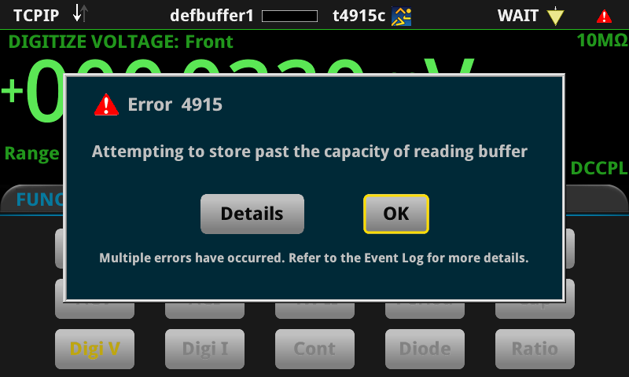

# 2. A modal dialog appears over a running app for events that `localnode.showevents = 0` does not suppress

**DMM6500, firmware 1.7.17a.** No signal, no USB key, no second instrument needed.

## Summary

Arming a `LoopUntilEvent` trigger model over a digitize buffer in `FILL_ONCE` posts event **4915**
*"Attempting to store past the capacity of reading buffer"* **ten times per capture** at every sample rate
from 50 kS/s upward. With `localnode.showevents = 0` in force, 4915 puts a **modal dialog on the front
panel over whatever is displayed**:



The dialog stays until somebody presses a button. Every event that arrives behind it is absorbed into the
single line *"Multiple errors have occurred. Refer to the Event Log for more details."* — so on an
unattended instrument the first such event blocks the panel indefinitely and hides everything after it.

**`localnode.showevents` is not the answer, and severity is not the rule.** With the identical
`localnode.showevents = 0`:

| event | severity | dialog on the panel? |
|---|---|---|
| 1130 *Parameter id, expected value from 0 to 511* (display) | 1, error | **no** |
| 2205 *File not found* (file) | 1, error | **no** |
| 4915 *Attempting to store past the capacity of reading buffer* | 1, error | **yes** |
| 2874 *Analog trigger condition may no longer be valid* | 2, warning | **yes** |

Two error-severity events are suppressed and a third is not; a *warning* raises a dialog while ten
*errors* queued behind it raise nothing. So this is not "the panel shows error severity whatever
showevents says" — some subsystems honour the setting and the trigger/acquisition subsystem does not.

**Warnings can be silenced from the glass and errors cannot.** The 2874 dialog carries a **Suppress**
button; the 4915 dialog has only **Details** and **OK**.

## Why 4915 fires

`LoopUntilEvent` reserves a pre-trigger fraction of the buffer — 5 % here. While the model waits for its
event, that reserve keeps the most recent readings, so it wraps; on a `FILL_ONCE` buffer every overwrite
is a discard, and each discard posts the event.

**It has nothing to do with the analog trigger.** The measurements below wait on
`trigger.EVENT_DISPLAY` — the front-panel TRIGGER key, never pressed — so no analog trigger is configured
and 2874 cannot fire. 4915 appears exactly as before.

## Measured

One armed capture per row, 20 000-sample buffer, 5 % pre-trigger, `dmm.digitize.count = 20000`, event
`trigger.EVENT_DISPLAY`, 2 s armed, `localnode.showevents = 0` throughout.

| fill mode | sample rate | samples returned | 4915 events |
|---|---|---|---|
| `FILL_ONCE` | 10 kS/s | 19 999 | **0** |
| `FILL_ONCE` | 50 kS/s | 20 000 | **10** |
| `FILL_ONCE` | 100 kS/s | 20 000 | **10** |
| `FILL_ONCE` | 250 kS/s | 20 000 | **10** |
| `FILL_ONCE` | 500 kS/s | 20 000 | **10** |
| `FILL_ONCE` | 1 MS/s | 20 000 | **10** |
| **`FILL_CONTINUOUS`** | **1 MS/s** | **20 000** | **0** |

Three things follow:

1. **Always exactly ten**, at every rate that produces any. Not proportional to the wait or the rate.
2. **The threshold is between 10 and 50 kS/s.** Below it, none — and note the depth comes back one short.
3. **`FILL_CONTINUOUS` avoids it entirely at the top rate with the full depth returned.** That is the
   workaround, and it is the answer to a question this report previously left open.

The full event set for one armed capture at 1 MS/s is 12 entries: `2731` *path initiated* (severity 4),
`4915` × 10 (severity 1), `2728` (severity 2).

## Reproduction

`repro-02-4915.tsp`. **The `trigger.model.load` signature takes six parameters** — name, event,
pre-trigger per cent, clear, delay, buffer. Four gives **2747** *"For trigger model load with
LoopUntilEvent, parameter 4 must be type clear"* and nothing arms.

```lua
localnode.showevents = 0                    -- and watch the panel anyway
eventlog.clear()
local buf = buffer.make(20000, buffer.STYLE_STANDARD)
buf.fillmode = buffer.FILL_ONCE             -- FILL_CONTINUOUS here gives 0 events
dmm.digitize.func = dmm.FUNC_DIGITIZE_VOLTAGE
dmm.digitize.range = 10
dmm.digitize.samplerate = 1000000
dmm.digitize.count = 20000
-- Waits on the front-panel TRIGGER key, which nobody presses: no analog trigger is involved.
trigger.model.load('LoopUntilEvent', trigger.EVENT_DISPLAY, 5, trigger.CLEAR_ENTER, 0, buf)
trigger.model.initiate()
delay(3)
trigger.model.abort()
print('events after ONE armed capture = ' .. tostring(eventlog.getcount()))
print('LOOK AT THE PANEL: a modal Error 4915 dialog is over whatever screen was showing.')
```

## Expected

One of:

* an app-visible way to keep an event off the panel, so an unattended instrument stays silent — what
  `localnode.showevents` appears to promise and does deliver for other subsystems; or
* 4915 not being error severity, since discarding pre-trigger readings from a wrapping reserve is normal
  operation for `LoopUntilEvent` rather than a fault; or
* the reserve not discarding into a `FILL_ONCE` buffer while the model is still waiting to trigger.

## Actual

Ten error-severity events per capture from 50 kS/s upward, the first of them a modal dialog over the app,
no setting that prevents it, and no Suppress button on it.

## Impact

A modal dialog that cannot be suppressed is disqualifying for any TSP app intended to be left running — a
logger, a monitor, a production fixture — because it blocks the panel until someone dismisses it and there
is nobody there. It also hides everything behind it: the ten 4915s and any unrelated event that follows
collapse into one "Multiple errors have occurred" line, so the log is the only place the truth survives.

## Not yet characterised

1. **Whether any `position` value avoids it without an unacceptable depth cost.** The firmware computes
   post-trigger count as `count - count x position/100`, so a reserve long enough to cover a slow edge
   wait at 1 MS/s costs roughly two thirds of the capture. Measure events and returned samples against
   `position` from 5 to 66.
2. **Why exactly ten.** The count does not vary with rate or wait, which suggests a fixed number of
   discard notifications rather than one per overwrite.
3. **Which other subsystems ignore `showevents`.** Four events are classified above; the display and file
   subsystems honour it, the trigger subsystem does not. A full map would need one event per subsystem.
