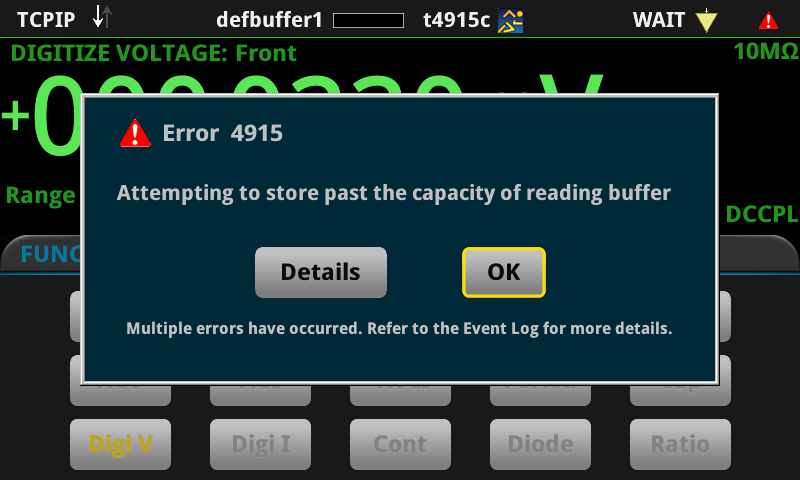

# 2. A modal dialog appears over a running app for events that `localnode.showevents = 0` does not suppress

**DMM6500, firmware 1.7.17a.** No signal, no USB key, no second instrument needed.

## Summary

Arming a `LoopUntilEvent` trigger model over a digitize buffer in `FILL_ONCE` posts event **4915**
*"Attempting to store past the capacity of reading buffer"* **ten times per capture** at every sample rate
from 50 kS/s upward. With `localnode.showevents = 0` in force, 4915 can put a **modal dialog on the front
panel over whatever is displayed**:



The dialog stays until somebody presses a button, or until a `display.changescreen()` lands on it. Every
event that arrives behind it is absorbed into the single line *"Multiple errors have occurred. Refer to the
Event Log for more details."* — so on an unattended instrument the first such event blocks the panel
indefinitely and hides everything after it. **The ten log entries reproduce every time; the dialog does
not, and what decides it is unidentified** — see "The dialog is narrower than the event" below.

**`localnode.showevents` is not the answer, and severity is not the rule.** With the identical
`localnode.showevents = 0`:

| event | severity | dialog on the panel? |
|---|---|---|
| 1130 *Parameter id, expected value from 0 to 511* (display) | 1, error | **no** |
| 2205 *File not found* (file) | 1, error | **no** |
| 4915 *Attempting to store past the capacity of reading buffer* | 1, error | **yes** |
| 2874 *Analog trigger condition may no longer be valid* | 2, warning | **yes**, and only when the trigger condition is incoherent with the active function |

Two error-severity events are suppressed and a third is not; a *warning* raises a dialog while ten
*errors* queued behind it raise nothing. So this is not "the panel shows error severity whatever
showevents says" — some subsystems honour the setting and the trigger/acquisition subsystem does not.

**Warnings can be silenced from the glass and errors cannot.** The 2874 dialog carries a **Suppress**
button; the 4915 dialog has only **Details** and **OK**.

## Why 4915 fires

`LoopUntilEvent` reserves a pre-trigger fraction of the buffer — 5 % here. While the model waits for its
event, that reserve keeps the most recent readings, so it wraps; on a `FILL_ONCE` buffer every overwrite
is a discard, and each discard posts the event.

**It has nothing to do with the analog trigger.** The measurements below wait on
`trigger.EVENT_DISPLAY` — the front-panel TRIGGER key, never pressed — so no analog trigger is configured
and 2874 cannot fire. 4915 appears exactly as before.

## Measured

One armed capture per row, 20 000-sample buffer, 5 % pre-trigger, `dmm.digitize.count = 20000`, event
`trigger.EVENT_DISPLAY`, 2 s armed, `localnode.showevents = 0` throughout.

| fill mode | sample rate | samples returned | 4915 events |
|---|---|---|---|
| `FILL_ONCE` | 10 kS/s | 19 999 | **0** |
| `FILL_ONCE` | 50 kS/s | 20 000 | **10** |
| `FILL_ONCE` | 100 kS/s | 20 000 | **10** |
| `FILL_ONCE` | 250 kS/s | 20 000 | **10** |
| `FILL_ONCE` | 500 kS/s | 20 000 | **10** |
| `FILL_ONCE` | 1 MS/s | 20 000 | **10** |
| **`FILL_CONTINUOUS`** | **1 MS/s** | **20 000** | **0** |
| `FILL_CONTINUOUS`, analog trigger configured as the source | 1 MS/s | 20 000 | **0** |

The last row matters because the rest of the table waits on `trigger.EVENT_DISPLAY`, where no analog
trigger is configured at all. Configuring the comparator as the source -- edge mode, level and slope set,
which is what an app doing edge-triggered acquisition actually does -- gives **two events for the whole
armed capture and no dialog**: `2731` *path initiated* and one path-idled entry. **2874 does not fire when
the trigger condition is coherent with the active function**, so the warning dialog above belongs to a
misconfigured comparator rather than to arming as such.

Four things follow:

1. **Always exactly ten**, at every rate that produces any. Not proportional to the wait or the rate.
2. **The threshold is between 10 and 50 kS/s.** Below it, none — and note the depth comes back one short.
3. **`FILL_CONTINUOUS` avoids it entirely at the top rate with the full depth returned.** That is the
   workaround. Note that the CONSTANT `buffer.FILL_CONTINUOUS` does not exist on this firmware and
   assigning it raises; the attribute takes the numeric value, and `fillmode = 1` reads back as 1.
   `defbuffer1` ships in that mode.
4. **What remains after the workaround is two log entries per armed capture**, `2731` and a path-idled
   entry, neither of which raises a dialog. For an app that must keep the event log clean -- because an
   accumulating log raises "Multiple errors have occurred" by itself -- two per capture is still two.

The full event set for one armed capture at 1 MS/s is 12 entries: `2731` *path initiated* (severity 4),
`4915` × 10 (severity 1), `2728` (severity 2). The same capture filling `defbuffer1` to its 100,000
capacity filed a thirteenth, **4918**, between the last 4915 and `2728`; its text was not captured, so the
number is all we have.

## The dialog is narrower than the event

The grab above is this firmware with the capture running inside a **named script** — `t4915c` in the top
bar — and the panel in **WAIT**. Re-run as anonymous socket chunks, **seven captures filed the ten entries
every time and left the panel clean**: the script below verbatim at 1 MS/s on a scratch buffer and on
`defbuffer1`, in both cases with the model read from inside the chunk as `trigger.STATE_WAITING` at block 4,
so the reserve was wrapping; a plain `BLOCK_MEASURE_DIGITIZE` overrunning its buffer at 40 kS/s and at
1 MS/s; and a host-side `buffer.write.reading` past a capacity-10 buffer. The host write and the 40 kS/s
store were each run at `localnode.showevents` 0 and at 1 with no difference, and the set spans both the
native screen and a running TSP app over it. A bare
`eventlog.suppress()` raises its own **-109** box in the same screen-grab path, so the capture does see
dialogs.

**Refuted as the discriminator:** the provocation path, the sample rate, the fill mode, the buffer
(`defbuffer1` behaves exactly like a scratch buffer), the active screen, and `localnode.showevents`. The
box also carries *"Multiple errors have occurred"* below its buttons, so it may be a collapse box over a
queue rather than a first-error box. **Either way the ten error-severity entries per capture reproduce
every time**, and they are the half an unattended app cannot live with.

## Reproduction

`repro-02-4915.tsp`. **The `trigger.model.load` signature takes six parameters** — name, event,
pre-trigger per cent, clear, delay, buffer. Four gives **2747** *"For trigger model load with
LoopUntilEvent, parameter 4 must be type clear"* and nothing arms.

```lua
localnode.showevents = 0                    -- and watch the panel anyway
eventlog.clear()
local buf = buffer.make(20000, buffer.STYLE_STANDARD)
buf.fillmode = buffer.FILL_ONCE             -- FILL_CONTINUOUS here gives 0 events
dmm.digitize.func = dmm.FUNC_DIGITIZE_VOLTAGE
dmm.digitize.range = 10
dmm.digitize.samplerate = 1000000
dmm.digitize.count = 20000
-- Waits on the front-panel TRIGGER key, which nobody presses: no analog trigger is involved.
trigger.model.load('LoopUntilEvent', trigger.EVENT_DISPLAY, 5, trigger.CLEAR_ENTER, 0, buf)
trigger.model.initiate()
delay(3)
trigger.model.abort()
print('events after ONE armed capture = ' .. tostring(eventlog.getcount()))
print('LOOK AT THE PANEL. Sent as a socket chunk this leaves it clean; the ten entries are always there.')
```

Sent from a socket the entries are reliable and the panel is not. `repro-02-4915.tsp` prints that each 4915
is "shown on the panel as a modal dialog despite showevents = 0", which holds for the captured case and
not for a chunk.

## Expected

One of:

* an app-visible way to keep an event off the panel, so an unattended instrument stays silent — what
  `localnode.showevents` appears to promise and does deliver for other subsystems; or
* 4915 not being error severity, since discarding pre-trigger readings from a wrapping reserve is normal
  operation for `LoopUntilEvent` rather than a fault; or
* the reserve not discarding into a `FILL_ONCE` buffer while the model is still waiting to trigger.

## Actual

Ten error-severity events per capture from 50 kS/s upward, no setting that prevents them, and — in the
captured case — the first of them a modal dialog over the app with no Suppress button on it.

## Impact

A modal dialog that cannot be suppressed is disqualifying for any TSP app intended to be left running — a
logger, a monitor, a production fixture — because it blocks the panel until someone dismisses it and there
is nobody there. It also hides everything behind it: the ten 4915s and any unrelated event that follows
collapse into one "Multiple errors have occurred" line, so the log is the only place the truth survives.
The entries are disqualifying on their own terms too, dialog or no dialog: they reproduce every time, and
an accumulating log raises that same collapse line by itself.

## Not yet characterised

1. **Whether any `position` value avoids it without an unacceptable depth cost.** The firmware computes
   post-trigger count as `count - count x position/100`, so a reserve long enough to cover a slow edge
   wait at 1 MS/s costs roughly two thirds of the capture. Measure events and returned samples against
   `position` from 5 to 66.
2. **Why exactly ten.** The count does not vary with rate or wait, which suggests a fixed number of
   discard notifications rather than one per overwrite.
3. **Which other subsystems ignore `showevents`.** The display and file subsystems honour it; the trigger
   subsystem does not, and neither does the script subsystem -- a successful `script.delete()` posts a
   spurious -104 that appears as a dialog (see report 3). A full map would need one event per subsystem.
4. **What raises the dialog**, given that seven socket captures file the entries and raise nothing. The
   difference left between them and the grab is that the grab's capture ran inside a named script with the
   panel in `WAIT`. If a dialog belongs to the script subsystem rather than to the event, say so: an app
   needs to know whether running its acquisition from a loaded script is what puts the box up.
