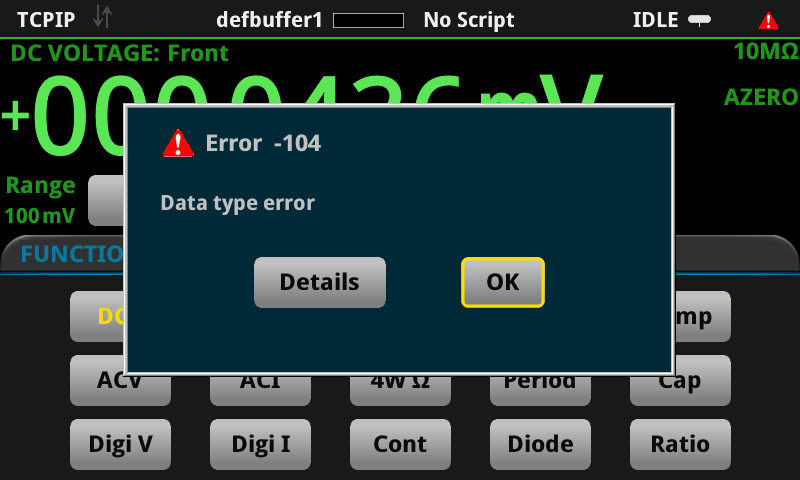

# 3. The execute path accepts exactly 1024 bytes per line, undocumented, and `script.delete` posts a spurious error dialog

**DMM6500, firmware 1.7.17a.** LAN raw socket, port 5025. No signal or second instrument needed; the USB
key is used only as somewhere to write to.

## Summary

**The execute path accepts exactly 1024 bytes on a line, terminator included.** One more raises **-363
"Input buffer overrun"**, which the panel renders as *"Too many characters were sent on one line."*
Bisected on the instrument:

```
963 characters of payload -> 1024 bytes sent -> executes, event log empty
964 characters of payload -> 1025 bytes sent -> -363, no reply at all
```

The number is not in the reference manual, so an app moving bulk data over the LAN has to discover it by
overrunning -- and the overrun lands on the panel as an error.

**It is a per-line limit, not a rate or a queue-depth limit.** 2000 statements of exactly 1024 bytes
through one socket, each one acknowledged before the next was sent, moved **2 048 000 bytes in 3.4 s at
585 statements/s with an empty event log**. Nothing accumulates.

**A long statement cannot be split across lines.** Every line is parsed as a complete chunk, so an opening
`do` on its own line fails immediately with **-285 "TSP Syntax error at line 1: `end' expected near
`<eof>'"**. There is no continuation mechanism on the execute path, which leaves 1024 bytes as a hard
ceiling on one statement.

**And the one transport that does take bulk data cannot be used repeatedly in silence.** `loadscript`
accepts **805 285 bytes / 14 686 lines in 1.0 s** with no flow control and an empty log, but reloading a
name requires dropping it first, and `script.delete()` -- **which succeeds, returning true with no
error** -- logs a spurious **-104 "Data type error"** that appears as a modal dialog on the front panel
with `localnode.showevents = 0` in force:



So a chunked transfer over `loadscript` puts a dialog in front of the operator once per chunk.

## Reproduction

`repro-03-buffer-overrun.py` bisects the limit and then holds at it. Every statement prints its own
acknowledgement and the host reads that reply before sending anything else, so the host is never more than
one statement ahead of the interpreter -- a buffer overrun under those conditions cannot be a rate problem.
A fresh socket is used for each bisect attempt, because a statement that overruns leaves the parser holding
a fragment and the next attempt would measure the fragment.

```
python3 repro-03-buffer-overrun.py --ip <dmm-ip>              # bisect
python3 repro-03-buffer-overrun.py --ip <dmm-ip> --soak 2000  # and hold at the limit
```

```
    600 pad,   661 bytes sent -> LEN=600      EV=0
   2000 pad,  2061 bytes sent -> None         EV=1   -363 Input buffer overrun
    ...
    962 pad,  1023 bytes sent -> LEN=962      EV=0
    963 pad,  1024 bytes sent -> LEN=963      EV=0
    964 pad,  1025 bytes sent -> None         EV=1   -363 Input buffer overrun
LARGEST WORKING pad 963 (1024 bytes sent), SMALLEST FAILING pad 964 (1025 bytes sent)
```

The statement under test is `do local s = "<pad>" print("LEN=" .. tostring(string.len(s))) end`, so the
1024 counts everything on the wire including the newline.

## Expected

1. **The limit documented.** 1024 bytes on a line is a designed number, not an accident, and an app that
   moves data over the LAN has to know it. Nothing in the reference states it.
2. **A failure the program can see.** -363 arrives as an event and as a panel dialog; the statement simply
   produces no reply. A host that is not watching the event log cannot tell an overrun from a hang.
3. **`script.delete()` not logging an error when it succeeds.** It returns true and frees the name; the
   -104 is spurious, and it reaches the panel.

## Actual

1025 bytes on a line raises -363 with no reply. `script.delete()` succeeds and logs -104, which appears as
a modal dialog. Neither figure nor behaviour is documented.

## Impact

Moving bulk data to the instrument's USB key over the LAN is the only option when the key must not be
handled by hand, and the execute path is the only way to write a file. At 1024 bytes a line and 585 lines a
second the ceiling is about 600 kB/s, so a 19 MB plan file takes minutes -- against 805 kB in 1.0 s for
`loadscript`, which is the same instrument, the same socket and no flow control at all.

The failure modes both reach the operator: -363 for a line that is one byte too long, and -104 for every
`script.delete` in a chunked transfer over the fast path.

## Still open

1. **Is `loadscript` the sanctioned transport for bulk data?** If so it deserves saying in the reference,
   and the -104 needs fixing, because those two together are what make the fast path unusable for
   repeated transfers.
2. **What is the ceiling on a single `loadscript` chunk?** 805 285 bytes is the largest measured, not a
   measured limit.
3. **Why exactly 1024**, and is the same limit in force on the USB/GPIB paths? Only LAN raw socket 5025
   has been measured here.
